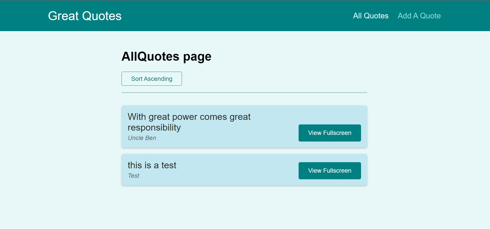
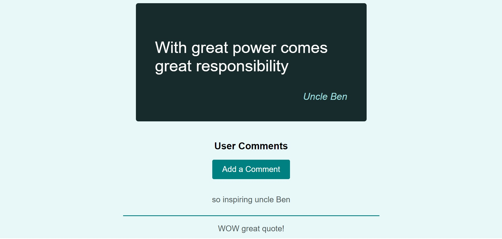

# quote App

view post and comment on the great quotes. 

## Screenshots






## Installation

Install GreatQuotes-App with npm

```bash
  cd GreatQuotes-App
  npm install package.json
```
    
## Environment Variables

To run this project, you will need to add the following environment variables to your .env file

`REACT_APP_FB_KEY`

Firebase key

Link: https://firebase.google.com/

